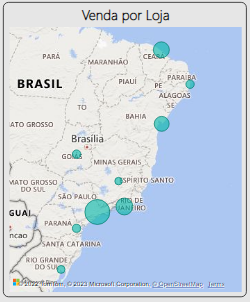

# Dica - como resolver falha para carregar o mapa

Para o relatório, utilizei o Power BI Desktop para edição e quando fui adicionar um mapa, me deparei com essa mensagem:

Como utilizei uma conta corporativa para logar no Power BI, descobri que era necessário habilitar o uso de mapas no [Portal de Administração do Power BI](https://app.powerbi.com/admin-portal/tenantSettings). Tem um vídeo no Youtube interessante sobre isso ([Habilitar as visuals nas Configurações de locatário](https://www.youtube.com/watch?v=enxLrGRiL68)), a configuração pode variar de acordo com as políticas da organização (pode ser necessário apenas liberar para você, por exemplo, ou pode ficar bloqueado para evitar violações nas legislações de dados, como LGPD, GDPR, entre outras).

Porém caso não possua conta corporativa e não aparecer o mapa, provavelmente irá aparecer o aviso desta forma.

Para resolver neste caso, acesse o menu Arquivo > Opções e configurações > Opções. Depois, clique em Segurança e deixe marcada a opção "Usar visuais de Mapa e Mapa Preenchido".

Reinicie o Power BI e pronto! Tudo certo!

Por hora é só! Obrigado!
