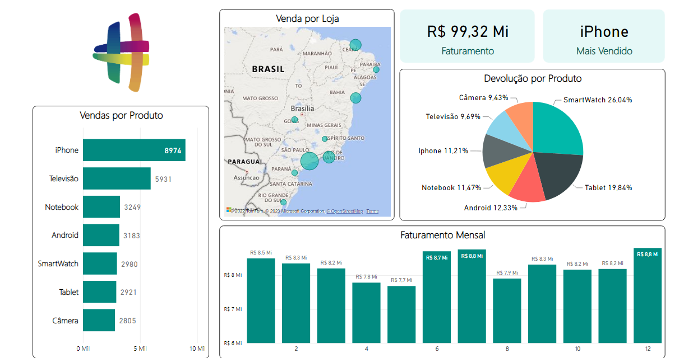

# Inicial

Olá! Este repositório terá um conteúdo simples, do primeiro relatório de Power BI que fiz. Como identifiquei uma oportunidade para ingressar na área de BI, por hora vou focar nestes conteúdos para em breve fazer o exame da certificação PL-900. Assim que concluir a certificação, volto a alimentar os conteúdos dos outros repositórios. 

## Meu primeiro relatório - [Link para baixar o arquivo](/Relatorio1.pbix) 

## Conteúdo adicional

* Link para Baixar o [Power BI Desktop](https://powerbi.microsoft.com/pt-br/desktop/)

* [Vídeo Youtube - Como sair do ZERO no POWER BI em apenas UMA AULA](https://youtu.be/UFGe25gydxo)

* [Dica - como resolver falha para carregar o mapa (apenas caso utilizar para uso pessoal)](/FalhaMapa)

